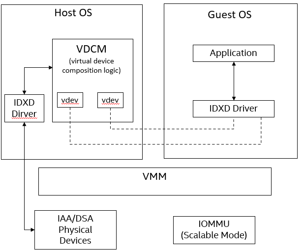
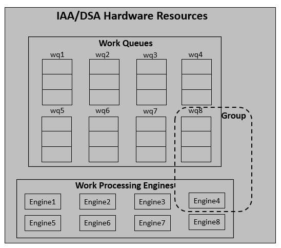
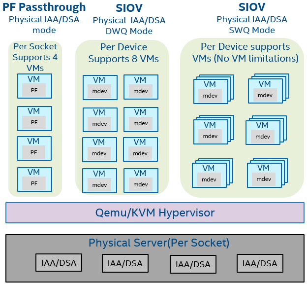

# In-Memory Analytics Accelerator (IAA) And Data Streaming Accelerator (DSA) Virtualization Overview on (4th gen) Intel® Xeon® Scalable processors
 
## Introduction
 
This guide is for users who want to use Intel® IAA and DSA accelerators on a VM (Virtual Machine) with SIOV virtualization.
 
Intel® IAA - One of Intel seamlessly-integrated accelerators in the Next-gen Intel® Xeon® Scalable processor, aimed at optimizing analytics performance while offloading CPU cores, Intel® In-Memory Analytics Accelerator (Intel® IAA) was formerly referred to as IAX. Any references to IAX can be understood to be the same as Intel® IAA moving forward.
 
Intel® DSA - One of Intel seamlessly-integrated accelerators in the Next-gen Intel® Xeon® Scalable processor, aimed at high-performance data copy and transformation accelerator, targeted for optimizing streaming data movement and transformation operations common with applications for high-performance storage, networking, persistent memory, and various data processing applications.
 
Intel® Scalable I/O Virtualization - The technology is focused on efficient and scalable sharing of I/O devices, such as network controllers, storage controllers, graphics processing units, and other hardware accelerators across a large number of containers or virtual machines. Intel Scalable IOV not only provides much more scalability at a lower cost than today’s standard, Single Root I/O Virtualization (SR-IOV), it does so without sacrificing the performance benefits that SR-IOV is known for. Another important aspect of Intel Scalable IOV is that it introduces the notion of composability, allowing more frequent and performance-critical operations to be run directly on hardware while complex control and configuration operations are emulated through software. This flexibility enables simpler device hardware designs and can help address limitations associated with direct device assignments such as generational compatibility, live migration, and memory over-commitment.
 
### IAA/DSA SIOV Software Stack Overview
 

 
- VDCM: Virtual Device Composition Module, is responsible for managing virtual device instances
- IDXD: Intel® Data Accelerator Driver
- vdev: virtual IAA/DSA devices
- IOMMU Scalable Mode: a scalable and flexible approach to hardware-assisted I/O virtualization.
 
 
### Server Configuration
 
#### Hardware
 
The configuration described in this article is based on 4th Generation Intel® Xeon® processor hardware. The server platform, memory, hard drives, and network interface cards can be determined according to your usage requirements.
 
| Hardware | Model |
|----------------------------------|------------------------------------|
| Board | EAGLESTREAM, E63448-400 |
| CPU | Intel® SPR E3 stepping, base Frequency 1.9GHz |
| BIOS | EGSDCRB1.86B.0080.D21.2205151325 |
| Memory | 224 GB(14x16GB DDR5 4800 MT/s) |
| Storage/Disks | INTEL SSDSC2KB960G8 |
| NIC (if it applies) | Intel® E810 100GbE Ethernet Network Adapter |
 
#### Software
 
| Software | Version |
|------------------|-------------|
| Operating System | CentOS Stream release 8 |
| Kernel | ? |
| Qemu | ? |
| GCC | version: 8.5.0 |
| accel-config | version: 3.4.4+ |
 
 
## Hardware Tuning
 
This guide targets the usage of user space workloads on 4th Gen Intel Xeon Scalable processors with Intel® In-Memory Analytics Accelerator (IAA) and Data Streaming Accelerator(DSA). 
 
IAA 1.0 and DSA 1.0 Technical Specification have already been public disclosure and published on February 2022. The spec passed all technical and BU approvals and is being processed for further publication on [Intel SDM website] (https://www.intel.com/content/www/us/en/developer/articles/technical/intel-sdm.html).
 
 
### BIOS Settings
 
Download BIOS binaries from Intel or ODM-released BKC-matched firmware binaries (for example BKC#57, which we chose), and flush them to the board. 
 
Some BIOS configuration items:
 
| Configuration Item | Recommended Value|
|---------------------|------------------|
| EDKII Menu -> Socket Configuration -> IIO Configuration -> Intel VT for directed I/O (VT-d) -> Intel VT for directed IO | Enable |
| EDKII Menu -> Socket Configuration -> IIO Configuration -> Intel VT for Directed I/O (VT-d) -> Opt-Out Illegal MSI Mitigation | Enable |
| EDKII Menu -> Socket Configuration -> IIO Configuration -> PCI ENQCMD/ENQCMDS | Enable |
| EDKII Menu -> Socket Configuration -> Processor Configuration -> VMX | Enable |
|  |  |
 
### IAA/DSA Configuration Setting
 
accel-config is a user-space tool for controlling and configuring IAA/DSA hardware devices.
 
How to install the accel-config tool, please refer to *https://github.com/intel/idxd-config*
 
 
# Enable devices
### IAA/DSA Virtual Devices Enabling On The Host OS
 
For example, to enable an IAA virtual device(mdev) with four engines and a shared work queue. 
 
For the mdev introduction, please refer to [mdev Introduction](https://docs.kernel.org/driver-api/vfio-mediated-device.html).
 
`#accel-config config-engine iax0/engine0.0 -g 0`
 
`#accel-config config-engine iax0/engine0.1 -g 0`
 
`#accel-config config-engine iax0/engine0.2 -g 0`
 
`#accel-config config-engine iax0/engine0.3 -g 0`
 
`#accel-config config-wq iax0/wq0.0 -g 0 -s 32 -p 10 -b 1 -t 15 -m shared -y mdev -n guest1 -d mdev`
 
`#accel-config enable-device iax0`
 
`#accel-config enable-wq iax0/wq0.0`
 
 
### IAA/DSA Virtual Device Assignment
 
For example, assign a shared work queue as a virtual device of the IAA device (BDF 0000:6a:02.0) to the VM, each virtual device has a unique identifier, user can use uuidgen to generate the value. 
 
If the user wants to create a virtual DSA device, replace idxd-iax-1swq-v1 with idxd-dsa-1swq-v1.
 
The mdev support types including
 
- idxd-dsa-1dwq-v1
- idxd-dsa-1swq-v1
- idxd-iax-1dwq-v1
- idxd-iax-1swq-v1
 
`#uuidgen`
 
`#echo ebc28cf8-2623-4331-9806-5663af670d40 > /sys/class/mdev_bus/0000:6a:02.0/mdev_supported_types/idxd-iax-1swq-v1/create`
 
Add the virtual device for the Qemu boot parameter.
 
`-device vfio-pci, sysfsdev=/sys/bus/pci/devices/0000:6a:02.0/ebc28cf8-2623-4331-9806-5663af670d40`
 
The vIOMMU Scalable mode emulation also needs to be added to the Qemu boot parameters.
 
`-device intel-iommu,caching-mode=on,dma-drain=on,x-scalable-mode="modern",device-iotlb=on,aw-bits=48`
 
### IAA/DSA Virtual Devices Enabling On The Guest OS
When the Guest OS startup, the user needs to enable virtual IAA/DSA devices before use on the Guest OS.
 
`#accel-config config-wq -y user -n app -d user iax0/wq0.0`
 
`#accel-config enable-wq iax0/wq0.0`
 
### IAA/DSA SIOV Performance Tuning Configuration
 
The IAA/DSA hardware resources including work queues and work processing engines below.
 

 
- Work Queues: On-device storage to contain the pending works submitted to the IAA/DSA hardware device.
- Work Processing Engines: Operational unit within IAA/DSA hardware device.
- Group: A configurable set of work queues and engines
 
By increasing the number of queues and engines, the workload can improve performance, including higher throughput and lower latency.
 
Users can also implement quality of service control (QoS) by setting group priorities, etc.
 
For More QoS information, please refer to [Intel DSA Spec](https://cdrdv2.intel.com/v1/dl/getContent/671116) and [Intel IAA Spec](https://cdrdv2.intel.com/v1/dl/getContent/721858).
 
### Memory Configuration/Settings
 
No specific workload setting
 
### Storage/Disk Configuration/Settings
 
No specific workload setting
 
### Network Configuration/Setting
 
No specific workload setting
 
## Conclusion
 
IAA and DSA hardware support both PF passthrough and SIOV virtualization solutions. The main differences between PF passthrough and SIOV below
 

 
- PF Passthrough: Each socket supports up to 4 VM instances, in addition to good performance, there is also good isolation.
- SIOV w/ DWQ:    Each physical device supports up to 8 VM instances, live-migration support, and good resource isolation since a dedicated work queue only serves with one VM.  
- SIOV w/ SWQ:    There is no limit on the maximum number of supported VM instances per physical device, the hardware resources will be shared by all instances and also supports live migration.
 
Users can use different virtualization solutions according to different user scenarios, such as using PF passthrough and SIOV with DWQ for high performance, and SIOV with SWQ solution for better scalability.  
 
## Feedback
 
We value your feedback. If you have comments (positive or negative) on this guide or are seeking something that is not part of this guide, please reach out and let us know what you think. 

*NOTICE:  This introduction is an IAA/DSA SIOV overview, and the operation steps do not represent the final product usage steps*
